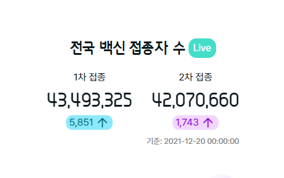
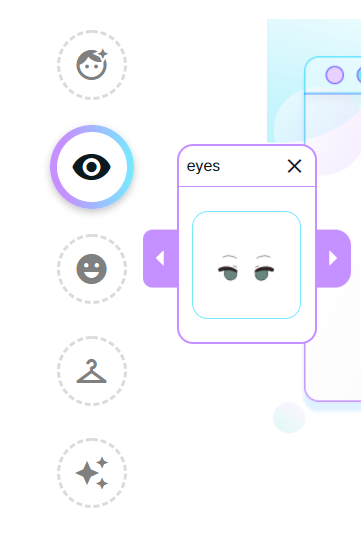
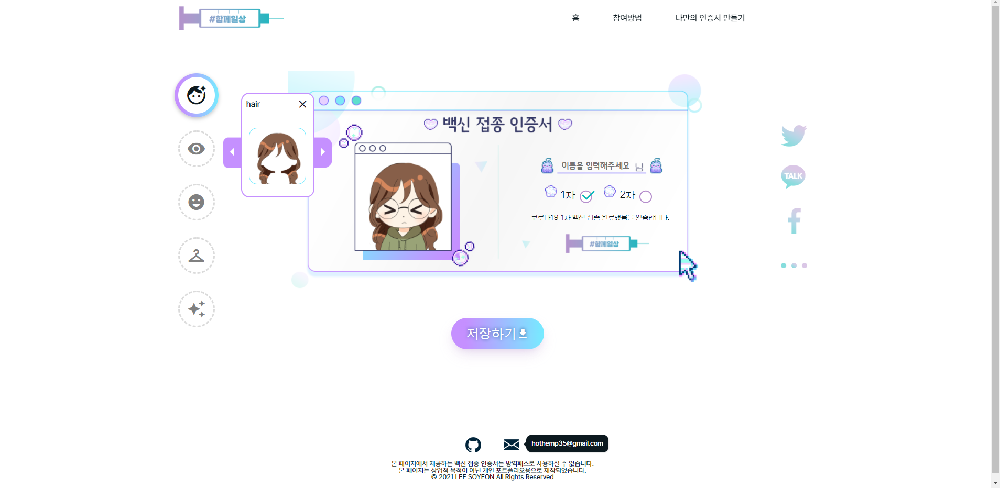

# VACCINE Campaign 
나만의 백신 인증서 만들기 사이트(옷입히기 게임) 제작 
https://soonmac.github.io/vaccine_campaign/

## 프로젝트 목표

JavaScript와 SCSS를 이용해 옷입히기 게임 구현

## 프로젝트에서 사용한 기술
### JavaScript ES6

jQuery를 사용하지 않고 순수 JavaScript으로만 작성

### SCSS 

7-1 패턴을 참고해 컴포넌트별로 나눠 작성했으며, main.scss에 임포트한 후 CSS로 컴파일

## 프로젝트의 기능 설명
### fetch()를 이용하여 공공데이터 API 호출 

* 코로나19 예방접종 통계 데이터 조회 서비스 이용
* Date 객체를 이용하여 오전 10시를 기준으로 통계 날짜를 업데이트

### 옷입히기 기능
#### 옷입히기 아이템 버튼

* 아이템 버튼 클릭시 모달창이 나오며 id값에 해당하는 항목의 타이틀과 이미지가 출력됩니다.
  
#### 옷입히기 기능

* 모달창의 화살표 버튼을 누르면 모달창에 뜬 아이템 이미지가 화면의 '백신 접종 인증서' 영역에 적용됩니다.
* html2cavnas 라이브러리를 이용하여 '백신 접종 인증서' 영역을 이미지로 저장할 수 있도록 작성했습니다.

* 저장한 이미지의 모습
  

### 반응형 웹페이지
*PC(1200px), 타블렛(768px), 모바일(480px) 해상도에 따라 보이도록 미디어 쿼리 작성

 
